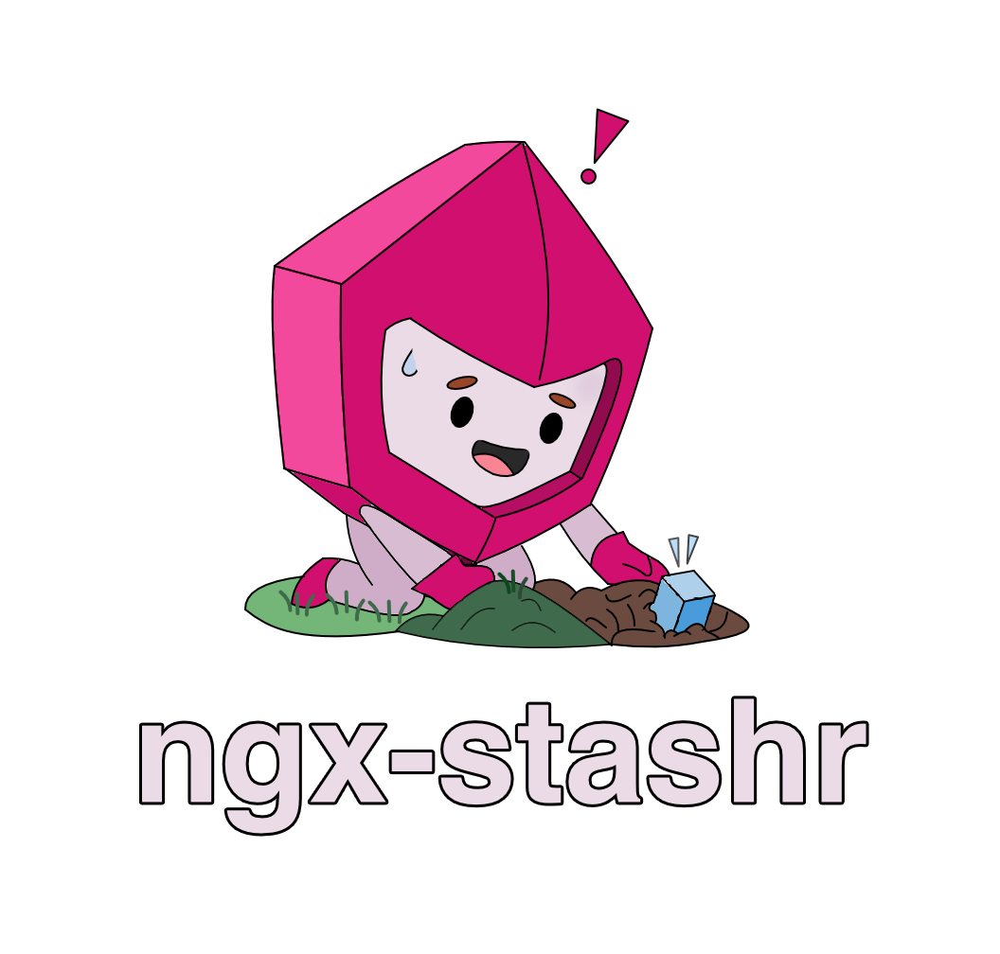

<div style="width: 100%;" align="center">
  <a href="https://github.com/nulzo/ngx-cachr">
    
  </a>
</div>

<h1 align="center">ngx-cachr</h1>

<p align="center">
  <strong>A slim, signal-based caching library for Angular.</strong>
</p>

<p align="center">
  <a href="https://www.npmjs.com/package/ngx-cachr">
    
  </a>
  <a href="https://www.npmjs.com/package/ngx-cachr">
    
  </a>
  <a href="https://github.com/nulzo/ngx-cachr/blob/main/LICENSE">
    
  </a>
</p>

<p align="center">
  Inspired by libraries like <a href="https://swr.vercel.app/">SWR</a> and <a href="https://tanstack.com/query/latest">TanStack Query</a>, but built specifically for Angular's Signals architecture.
</p>

---

## Installation

```bash
npm install ngx-cachr
```

## Features

- **Signal-Based**: Fully integrated with Angular Signals for granular reactivity.
- **Flexible Strategies**: Support for `cache-first`, `network-first`, and `stale-while-revalidate` (SWR).
- **Multi-Layer Caching**: Memory cache (L1) with LRU eviction and persistent Storage cache (L2) via LocalStorage.
- **Type Safe**: Built with TypeScript for full type inference.
- **Lightweight**: Minimal footprint, tree-shakeable.

## Usage

### 1. Provide the Service

Add `provideNgxCachr` to your application configuration (usually `app.config.ts`).

```typescript
import { ApplicationConfig } from '@angular/core';
import { provideRouter } from '@angular/router';
import { provideNgxCachr } from 'ngx-cachr';

export const appConfig: ApplicationConfig = {
  providers: [
    provideRouter(routes),
    provideNgxCachr({
      prefix: 'my-app:', // Prefix for storage keys
      defaultTtl: 300000, // 5 minutes
      defaultStrategy: 'swr', // Stale-While-Revalidate
      debug: true
    })
  ]
};
```

### 2. Use in Components

Use the `cachedResource` function to fetch and cache data. It returns a `CachedResource` object with `data`, `status`, and `error` signals.

```typescript
import { Component, computed, inject } from '@angular/core';
import { CommonModule } from '@angular/common';
import { HttpClient } from '@angular/common/http';
import { cachedResource } from 'ngx-cachr';

@Component({
  selector: 'app-user-profile',
  standalone: true,
  imports: [CommonModule],
  template: `
    @if (user.status() === 'loading') {
      <p>Loading...</p>
    } @else if (user.error()) {
      <p>Error loading user</p>
    } @else if (user.data()) {
      <h1>{{ user.data()?.name }}</h1>
      <p>Email: {{ user.data()?.email }}</p>
      
      <button (click)="user.invalidate()">Refresh</button>
    }
    
    @if (user.status() === 'revalidating') {
      <small>Updating in background...</small>
    }
  `
})
export class UserProfileComponent {
  http = inject(HttpClient);

  // Simple usage
  user = cachedResource({
    key: 'user-current',
    loader: () => this.http.get<any>('/api/user').toPromise(),
    ttl: 60 * 1000, // 1 minute
  });
}
```

### 3. Reactive Keys (Dependent Queries)

Pass a function that returns the options to make the query reactive. When dependencies change (signals used inside), the resource automatically re-fetches.

```typescript
userId = signal(1);

user = cachedResource(() => ({
  key: ['user', this.userId()], // Key changes when userId changes
  loader: () => this.fetchUser(this.userId())
}));

nextUser() {
  this.userId.update(id => id + 1);
  // user.data() automatically updates!
}
```

## Example Pattern: Service-Based Architecture

For larger applications, it's recommended to encapsulate your API logic in services. Here's how to build a robust, reusable data layer similar to TanStack Query but for Angular.

### Step 1: Create a Base HTTP Service

Create a reusable wrapper for your API calls.

```typescript
import { Injectable, inject } from '@angular/core';
import { HttpClient, HttpParams } from '@angular/common/http';
import { firstValueFrom } from 'rxjs';

@Injectable({ providedIn: 'root' })
export class ApiService {
  private http = inject(HttpClient);
  private baseUrl = 'https://api.example.com';

  async get<T>(endpoint: string, params?: Record<string, any>): Promise<T> {
    const httpParams = new HttpParams({ fromObject: params });
    return firstValueFrom(this.http.get<T>(`${this.baseUrl}${endpoint}`, { params: httpParams }));
  }
  
  // ... post, put, delete methods
}
```

### Step 2: Create Feature Services (Query Factories)

Instead of calling `cachedResource` in components directly with inline loaders, expose them as methods in a domain service. This keeps your components clean and logic reusable.

```typescript
import { Injectable, inject, signal } from '@angular/core';
import { cachedResource } from 'ngx-cachr';
import { ApiService } from '../../core/api.service';
import { Product } from './product.model';

@Injectable({ providedIn: 'root' })
export class ProductService {
  private api = inject(ApiService);

  /**
   * Fetches a list of products.
   * Key: ['products', category]
   */
  getProducts(category: () => string | null) {
    return cachedResource(() => ({
      key: ['products', category()],
      // Only fetch if category is present
      loader: async () => {
        const cat = category();
        if (!cat) return []; 
        return this.api.get<Product[]>('/products', { category: cat });
      },
      ttl: 5 * 60 * 1000, // 5 minutes
      strategy: 'swr'
    }));
  }

  /**
   * Fetches a single product details.
   * Key: ['product', id]
   */
  getProduct(id: () => string) {
    return cachedResource(() => ({
      key: ['product', id()],
      loader: () => this.api.get<Product>(`/products/${id()}`),
      strategy: 'cache-first' // Don't re-fetch if we have it in memory/storage
    }));
  }
}
```

### Step 3: Consume in Components

Your components now become purely reactive views.

```typescript
import { Component, inject, signal } from '@angular/core';
import { ProductService } from './product.service';

@Component({
  template: `
    <select #cat (change)="category.set(cat.value)">
      <option value="electronics">Electronics</option>
      <option value="books">Books</option>
    </select>

    @if (products.status() === 'loading') {
      <skeleton-loader />
    }
    
    @for (product of products.data(); track product.id) {
      <product-card [product]="product" />
    }
  `
})
export class ProductListComponent {
  private productService = inject(ProductService);
  
  category = signal('electronics');
  
  // This signal is now fully managed, cached, and reactive!
  products = this.productService.getProducts(this.category);
}
```

## Configuration

### `CacheConfig`

| Option | Type | Default | Description |
|---|---|---|---|
| `prefix` | `string` | `'ngx-cachr:'` | Namespace for storage keys. |
| `version` | `number` | `1` | Cache version. Bump to invalidate all persistent storage. |
| `defaultTtl` | `number` | `300000` | Default time-to-live in ms (5 mins). |
| `defaultStrategy` | `'cache-first' \| 'network-first' \| 'swr'` | `'swr'` | Default caching strategy. |
| `memory.maxEntries` | `number` | `100` | Max items in memory (LRU). |

### Caching Strategies

- **`swr` (Stale-While-Revalidate)**: Returns cached data immediately (if available), then fetches from network in the background to update the cache. Best for UI responsiveness.
- **`cache-first`**: Returns cached data if fresh. Only fetches from network if cache is missing or stale.
- **`network-first`**: Always fetches from network. Falls back to cache if network fails.

## License

MIT
